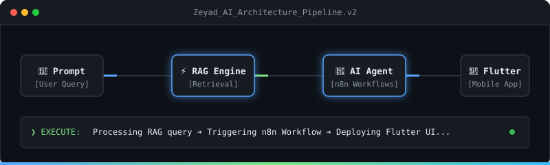
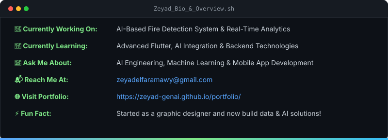
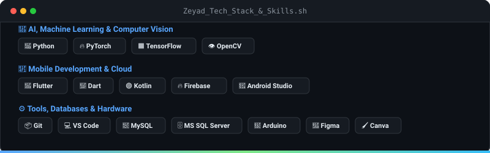
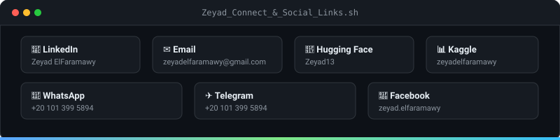
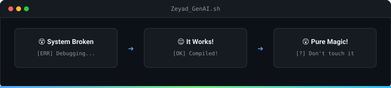

  <!-- 1. Master Animated Header -->
  

    

  <!-- 2. AI Architecture Pipeline -->
  

    

  <!-- 3. Bio & About Card -->
  

    

  <!-- 4. Tech Stack & Skills Matrix -->
  

    

  <!-- 5. Social Connect & Links -->
  

    

  <!-- 6. Developer Code Cycle -->
  

    

