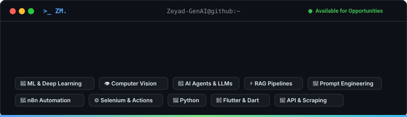

  

  

<h1 align="center">Hi 👋, I'm Zeyad Mohamed Elfaramawy</h1>
<h3 align="center">AI Engineer | Machine Learning Engineer | AI Automation Developer | Mobile App Developer</h3>

  <em>Passionate about solving complex problems through modern AI technologies and building intelligent systems — from RAG chatbots & AI Agents to computer vision models and mobile apps.</em>

---

### 🚀 About Me

- 🔭 **Currently working on:** AI-Powered Mobile Applications, RAG Pipelines & Intelligent Automation Workflows.
- 🌱 **Currently learning:** Advanced Generative AI, Multi-Agent Systems & Cloud Scalability.
- 💬 **Ask me about:** AI Engineering, Machine Learning, Computer Vision, n8n Automation & Flutter App Development.
- 📬 **How to reach me:** [zeyadelfaramawy@gmail.com](mailto:zeyadelfaramawy@gmail.com)
- 🌐 **Portfolio:** [Zeyad ElFaramawy Portfolio](https://zeyad-genai.github.io/portfolio/)
- ⚡ **Fun fact:** I started as a graphic designer and evolved into building AI & mobile software solutions!

---

### 🌐 Connect with Me

  
  &nbsp;
  
  &nbsp;
  
  &nbsp;
  
  &nbsp;
  
  &nbsp;
  
  &nbsp;
  

---

### 🛠️ Tech Stack & Skills

#### 🧠 AI, Machine Learning & Data

   &nbsp;
   &nbsp;
   &nbsp;
   &nbsp;
   &nbsp;
   &nbsp;
  

#### 📱 Mobile Development

   &nbsp;
   &nbsp;
   &nbsp;
   &nbsp;
  

#### ⚙️ Automation, Tools & Databases

   &nbsp;
   &nbsp;
   &nbsp;
   &nbsp;
   &nbsp;
   &nbsp;
  

---

###

###

### 🔄 Code Cycle

  
  &nbsp;&nbsp;➔&nbsp;&nbsp;
  
  &nbsp;&nbsp;➔&nbsp;&nbsp;
  

